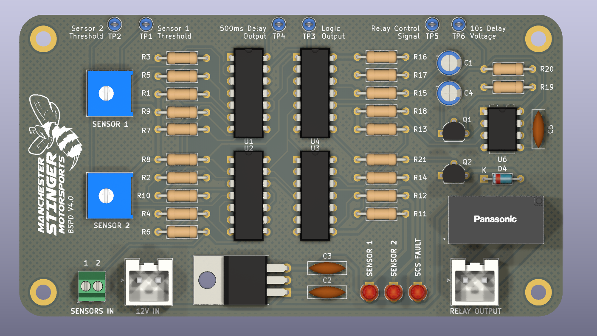

# BSPD

## Version Changelog

**V1.0**
- First Routed PCB

**V1.1**
- Changed R26 to 4.7k to limit current to base of the BJT controlling the relay

**V2.0**

- Changes are made after feedback from Dr. Theo
- Changed 500ms timer resistor to 430k with the assumption of 1% tolerence (Expected = 516ms, Min = 511ms, Max = 521ms)
- Changed the current limiting resistors from 470 to 4.7k to limit current to less than 1 mA (NAND gate limit)
- Removed copper pad on the mounting holes and added clearance from other copper pads
- Fixed ground routing loop on the PCB
- Smaller hatched copper pours
- Removed redundant voltage divider for SCS voltage reference

**V3.0**
- Replaced 5V supply input with 12V supply input
- Added 5V Voltage Regulator with capacitors
- Team logo added

**V4.0**
- Changed 5V Reg to a more common LM7805
- Changed transistors footprint to a bigger seperation pads footprint due to uni fabrication limitation
- Changed trimmer to a bigger but more common equivalent alternative
- Added diode for reverse relay coil voltage protection 
- PCB Routing optimised
- Added test points for easier troubleshooting